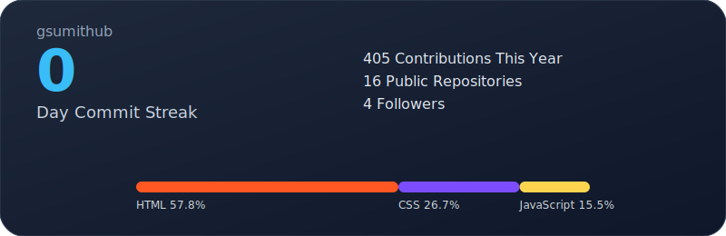

<!-- Banner -->
<!-- 

  

 -->
<h1 align="center">✨ Sumit Kumar — MERN Stack Developer ✨</h1>

  

---

## 🧑‍💻 About Me  

I'm a passionate **MERN Stack Developer** who loves building clean UI, optimized backend logic, and polished real-world web applications.  
I focus on:

- 🎨 Smooth, responsive UI  
- ⚡ Fast and efficient backend logic (Node.js / Express)  
- 🗃 Scalable MongoDB database models  
- 🚀 Production-ready full-stack applications  
- 🧼 Clean code, readable architecture  

---

## 🛠️ Tech Stack  

  

---

## 📊 GitHub Analytics (Self-Hosted)

  

---

## 🐍 Contribution Snake  (Self-Hosted)

  

---

## 🧩 My Web Dev Projects  

| Project | Preview | Live Demo |
|--------|---------|-----------|
| **E-Commerce App (React + Tailwind CSS)** | 
 | 
<a href="https://gsumithub.github.io/E-Commerce-App/">🚀 Live</a> |
| 
| **Law Prep Tutorial Clone (Bootstrap + jQuery)** |  | <a href="https://gsumithub.github.io/Law-prep-clone-bootstrap-jQuery/">🚀 Live</a> |
| **Solachey (Bootstrap + jQuery)** |  | <a href="https://gsumithub.github.io/Solachey-clone-Bootstrap-jquery/">🚀 Live</a> |
| **Movie App** |  | <a href="https://gsumithub.github.io/Movie-App/">🚀 Live</a> |
| **Smart City Mohali Clone** |  | <a href="https://gsumithub.github.io/Smart-City-Mohali_Clone/">🚀 Live</a> |
| **Count Down** |  | <a href="https://gsumithub.github.io/Count-Down/">🚀 Live</a> |
| **Digital Clock** |  | <a href="https://gsumithub.github.io/Digital-Clock/">🚀 Live</a> |
| **To Do List** |  | <a href="https://gsumithub.github.io/ToDoList/">🚀 Live</a> |
| **Spotify Clone** |  | <a href="https://gsumithub.github.io/Spotify_Clone/">🚀 Live</a> |
| **Myntra Clone** |  | <a href="https://gsumithub.github.io/Myntra_clone/">🚀 Live</a> |
| **IIP Website Clone** |  | <a href="https://gsumithub.github.io/IIP_clone/">🚀 Live</a> |
| **Figma to HTML** |  | <a href="https://gsumithub.github.io/Figma_to_HTML-project-WS-Cube-Tech-web-page-/">🚀 Live</a> |
| **Packshifts Clone** |  | <a href="https://gsumithub.github.io/Packshifts_clone/">🚀 Live</a> |
| **Solachey Clone** |  | <a href="https://gsumithub.github.io/Solachey_clone/">🚀 Live</a> |

## 🌐 Socials & Badges  

  
  
  

---

## 📫 Connect With Me  

  
  

---

  ✨ Thanks for visiting — I’m always building something cool. Stay tuned! ✨

