<!-- Banner -->

  

<h1 align="center">✨ Sumit Kumar — MERN Stack Developer ✨</h1>

  

---

## 🧑‍💻 About Me  

I'm a passionate **MERN Stack Developer** who loves building modern UI, clean backend systems, and polished real-world web apps.  
I focus on:  

- 🎨 Smooth, responsive UI  
- ⚡ Fast backend logic (Node/Express)  
- 🗃 Databases with MongoDB  
- 🚀 Full-stack projects that solve real problems  
- 🧼 Clean code, readable architecture  

---

## 🛠️ Tech Stack  

  

---

## 📊 GitHub Stats (Self-Hosted — Never Breaks)

  

---

## 🐍 Contribution Snake  

  

---

## 🚀 Featured Projects  

🔥 Click to view the repo

| Project | Preview |
|--------|---------|
| **Digital Clock** |  |
| **To Do List** |  |
| **Spotify Clone** |  |
| **Myntra Clone** |  |

---

## 🌐 Socials & Badges  

  
  
  

---

## 📫 Connect With Me  

  
  

---

  ✨ Thanks for visiting — I’m always building something cool. Stay tuned! ✨

